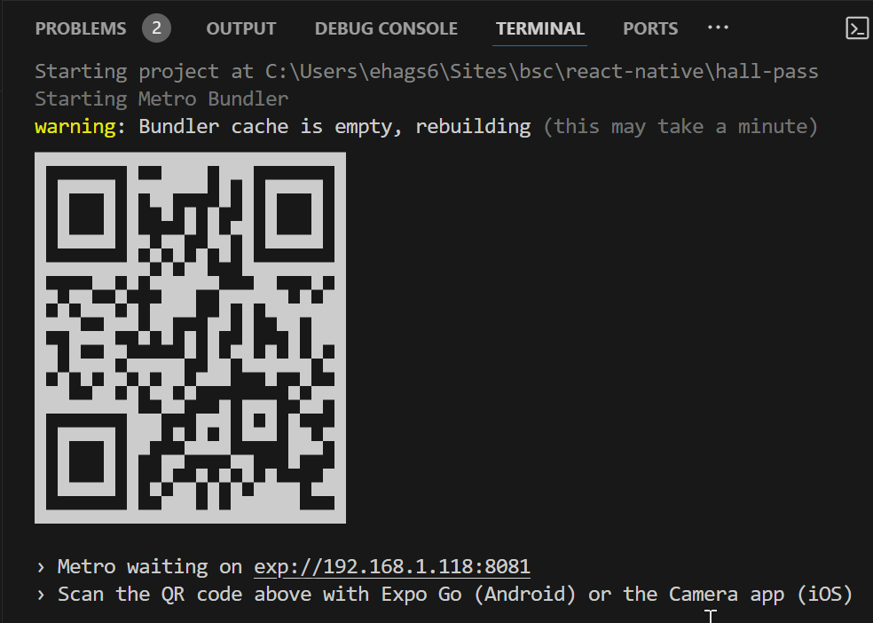

# Hall Pass - starter project

This is the starter project code for 'Hall Pass' - a To Do List app aimed at students studying for their undergraduate degree.

## Getting started

1. Open a terminal and run

   ```bash
   npm i
   ```

2. Next, install the Expo CLI tool on your machine:

   ```bash
   npm install -g expo-cli
   ```

3. If you want to develop for Android, you will need to install the Android Studio and the Android SDK:

   - Visit https://developer.android.com/studio to download this onto your machine.
   - During installation, make sure to check the box for "Android SDK" and the Android SDK Platform-Tools when selecting components.
   - Upon completion of the installation, open Android Studio to finish configuring the SDK Manager.

4. On your phone, install **Expo Go** from the app store for your device.

## Running the project

1. Start the server:

   ```bash
   npm run dev
   ```

2. You will see a QR code in your terminal like the one below:

   

   Scan this with your device to see a live preview of the app directly on your phone.

3. Alternatively, hit `w` in the terminal to open the app in the web browser.

4. If you want to view the app via a device simulator on your machine, you will need to research how to install Android Studio and the Android SDK on your machine. iPhone emulators are only supported on Apple Macs.

## Tech stack

The project makes use of the following:

- React Native - [docs](https://reactnative.dev/)
- Expo - [docs](https://expo.dev/)
- NativeWind - Use [TailwindCSS](https://tailwindcss.com/) classes in your React Native project. See [docs](https://www.nativewind.dev/)
- React Native Reusables - a library of UI elements built with [NativeWind](https://www.nativewind.dev/) classes. See [docs](https://rnr-docs.vercel.app/getting-started/introduction/)
